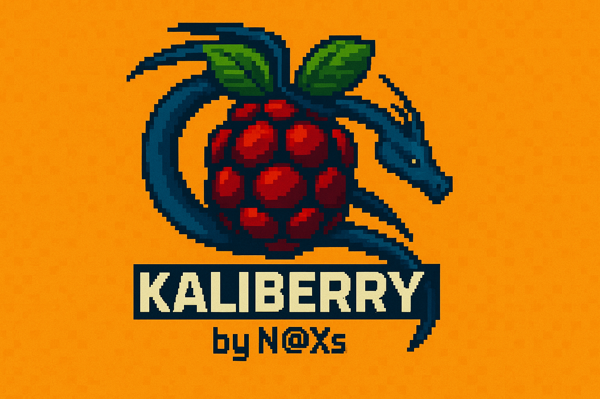

<p align="center">
  
</p>

# **KaliBerry - Installer for ColorBerry** 🐍🍓

**KaliBerry** is an interactive installer for **Kali Linux** on devices with a **ColorBerry** display.  
It automates and simplifies the installation of:

### 🛠️ Repositories and kernel for Raspberry Pi Zero 2 W  
### 🖥️ Display driver for ColorBerry  
### ⌨️ Keyboard driver for Beepberry  
### ⚙️ Complete bash environment setup in Kali Linux

All through a simple, text-based interface using `dialog`.

---

## 🚀 Installing Kali Linux on ColorBerry

Follow these steps to get your **ColorBerry** fully operational:

---

### 🔽 1. Download and install the Kali Linux image

🔗 [kali-linux-2024.2-raspberry-pi-armhf.img.xz](https://old.kali.org/arm-images/kali-2024.2/kali-linux-2024.2-raspberry-pi-armhf.img.xz)

Flash it to your SD card using **Raspberry Pi Imager**, **Balena Etcher**, or any other tool.

---

### ⚙️ 2. First boot and setup

1. Boot into Kali on your ColorBerry  
2. Connect to your **Wi-Fi** network  
3. Right-click the **clock widget** and select **Properties**  
4. Set your **timezone** to correct the system clock and avoid download errors

---

### 💻 3. Clone the KaliBerry repository

Open a terminal or connect via SSH and run:

```bash
sudo git clone https://github.com/ZoltXs/KaliBerry
📁 4. Enter the KaliBerry folder
cd KaliBerry
🔐 5. Make the script executable
sudo chmod +x KaliBerry.sh
▶️ 6. Run the installer
sudo ./KaliBerry.sh
🧭 7. Follow the step-by-step installer
Select every option from Option 1 through Option 5, without skipping any.
⚠️ If you interrupt the process, you must start again from Step 1.

✅ All done!

If you've followed every step, your ColorBerry is now fully set up and running Kali Linux 🎉

🧠 Credits
If you need any help with the display and keyboard drivers, please check out the builder's repository:
https://github.com/hyphenlee/jdi-drm-rpi

Project maintained by ZoltXs

If you want to help me with my great work and support me in building more projects like this, buy me a coffee ☕️.

Pulsa en este enlace para ayudarme. 😜
https://paypal.me/JbNoXs?country.x=ES&locale.x=es_ES

